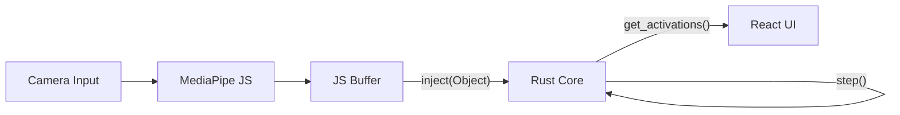

# ContextGraph-RS: Spreading Activation Engine in Rust


**ContextGraph-RS** is a high-performance, modular core library for Context Awareness logic based on **Spreading Activation Theory (SAT)**. 

This repository is a port of the "Project V6.0" JavaScript prototype into a robust Rust codebase, enabling:
1.  **Portability**: The same logic (`ContextEngine`) runs in Browsers (WASM), Robots (ROS2/Python), and Servers.
2.  **Scalability**: Capable of handling thousands of nodes/edges with zero garbage collection overhead.
3.  **Type Safety**: Rigid state management preventing runtime errors in complex graph interactions.

## 1. Architecture

The system follows a strict separation of concerns:

* **Core (Rust)**:
    * `ContextEngine`: The "Brain". Holds the graph state (nodes, weights) and executes the sigmoid propagation logic.
    * **Input**: `HashMap<String, f32>` (Normalized Sensor Data)
    * **Output**: `HashMap<String, f32>` (Activation Levels)
    * **Logic**: Energy Injection -> Spreading (Stiffness) -> Decay -> Sigmoid Activation.

* **Frontend (JavaScript/React)**:
    * **Sensation**: MediaPipe (Hands/Face/Holistic) extracts raw physical features.
    * **Preprocessing**: Simple Moving Average (SMA) buffers sensor data.
    * **Visualization**: Cytoscape.js renders the graph state returned by WASM.



## 2. Usage

### Development

```bash
# 1. Build WASM package
wasm-pack build --target web --out-dir www/pkg

# 2. Serve Locally
cd www
python3 -m http.server 8000

```

### Production / Library Use

The core logic in `src/lib.rs` is designed to be published as a crate or Python module (`maturin`).

```rust
// Rust Example
let mut engine = ContextEngine::new();
engine.inject(sensor_data); // {"IN_VEL": 0.8, ...}
engine.step();
let results = engine.get_ranked_states();

```

## 3. Future Roadmap

* **Dynamic Graph Loading**: Load graph definitions (JSON/YAML) at runtime instead of hardcoding.
* **Hebbian Learning**: Implement weight adjustment logic (`fire together, wire together`) in Rust.
* **Python Bindings**: Add `PyO3` support for direct integration with ROS2 nodes.

---
